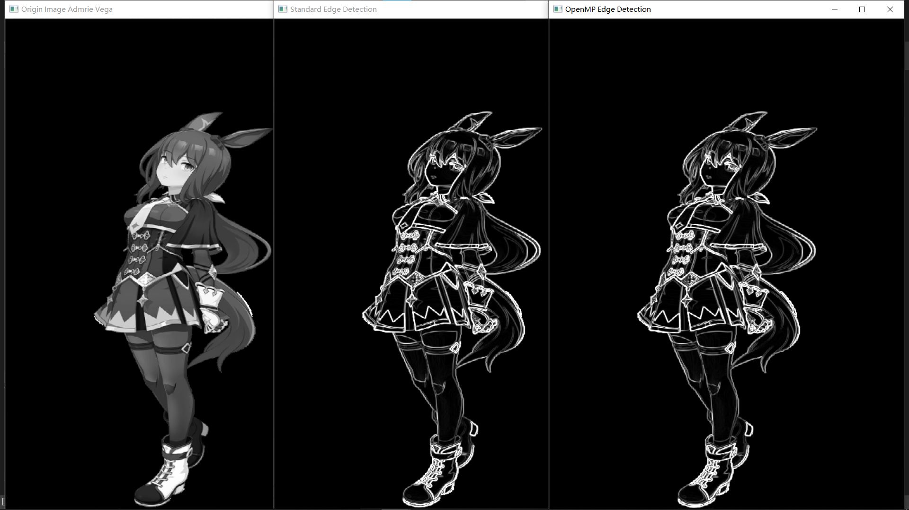
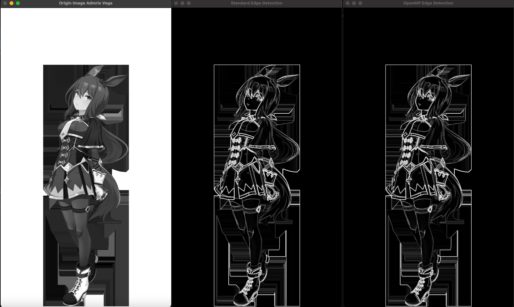

# 图像卷积运算边缘提取

可以使用卷积核来提取图像边缘。

定义两个3x3的卷积核 kernelX 和 kernelY，分别用于计算水平和垂直方向上的梯度。

    std::vector<std::vector<float>> kernelXV= { {1, 1, 1}, {0, 0, 0}, {-1, -1, -1} };

    std::vector<std::vector<float>> kernelYV= { {1, 0, -1}, {1, 0, -1}, {1, 0, -1} };

一个提取水平方向的边缘，一个提取竖直方向的边缘。在边缘处，梯度变化是最大的。

    void convolve(const cv::Mat& src, const std::vector<std::vector<float>>& kernel, cv::Mat& dst) {
        int padding = kernel.size() / 2;
        cv::Mat paddedSrc;
        cv::copyMakeBorder(src, paddedSrc, padding, padding, padding, padding, cv::BORDER_REPLICATE);
    
        dst.create(src.size(), CV_32F); // 创建浮点型矩阵
        for (int y = 0; y < src.rows; ++y) {
            for (int x = 0; x < src.cols; ++x) {
                float val = 0.0f;
                for (int ky = 0; ky < 3; ++ky) {
                    for (int kx = 0; kx < 3; ++kx) {
                        val += paddedSrc.at<uchar>(y + ky, x + kx) * kernel[ky][kx];
                    }
                }
                dst.at<float>(y, x) = val;
            }
        }
    }

卷积过程是可以并行化提高效率的，这就是CUDA比CPU更适合做这个的原因。这里可以用OMP优化这个循环。

在for循环前添加#pragma omp parallel for schedule(static)即可。在并行化开始时就将迭代均匀地分配给各个线程。

使用两个卷积核处理后得到上下边缘和左右边缘，再叠加即可。

## 检测结果

为这碟醋包了这顿饺子。（指阿雅贝）

## 运行结果

在Windows10(Intel i7-10875H)上运行结果

    Standard edge detection took 10823 microseconds.
    OpenMP edge detection took 6320 microseconds.
数据显示开OMP要节省近一半的时间。

在MacOS(M4)上运行结果

    ./output/edgeDetect
    Standard edge detection took 69029 microseconds.
    OpenMP edge detection took 18570 microseconds.

    # 开启O2优化
    Standard edge detection took 5308 microseconds.
    OpenMP edge detection took 6556 microseconds.

M4 芯片拥有强大的多核调度能力和内存带宽，在以下条件下表现出色：

没有启用 -O2 优化 → 编译器不做复杂重排和向量化，
使用 OpenMP 的 parallel for → 线程分配均匀，负载均衡好，
数据局部性较好（图像卷积操作具有局部访问特性）。
所以在默认情况下，OpenMP 并行化能带来显著加速。

为什么在开启 -O2 后，串行版本速度暴增，而 OpenMP 反而变慢？
串行版本变快是正常的，-O2 开启后，循环被展开、寄存器使用更高效、指令级并行提高。
尤其是对 for 循环中的浮点运算进行了自动向量化（SIMD），导致单线程性能大幅提升。

OpenMP 版本变慢则可能是线程创建/销毁开销大于收益。在 -O2 下串行代码已经非常快，OpenMP 的线程管理成本（如 fork/join）可能反而拖慢整体执行。
OpenMP 默认会创建与逻辑核心数相等的线程数，这在小规模任务中并不划算。